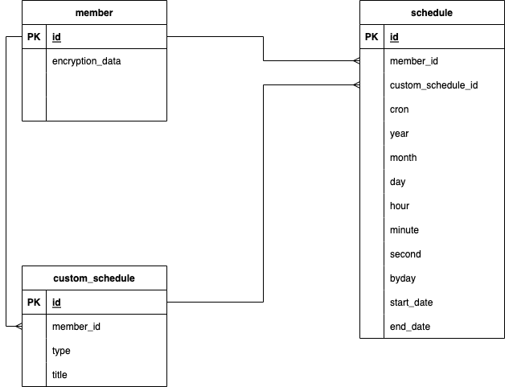

# MyRoutine
내 생활 습관을 바꾸기 위해 만드는 앱

## Spec
- Language : Python
- Framework : FastAPI || Flask
- DB : MySql

## DB Modeling 

- member : 회원 정보
  - 회원정보는 암호화해서 저장하기 위해 encryption_data 에 암호화한 데이터를 넣는다

- schedule : 회원의 스케줄을 저장한다.
  - 스케줄 데이터는 개발자들이 쉽게 해석할 수 있는 크론식으로 넣어놓는다.
  - 통계를 내기 위해 년/월/일 등을 따로 저장한다. 이는 물론 크론식을 따른다

- custom_schedule : 회원이 커스텀해서 넣거나 공통적인 것을 넣어놓는다
  - 회원이 만든것과 자주쓰이는(관리자가 만든)것은 타입으로 정한다.

## CI/CD
- Travis
- CodeDeploy
